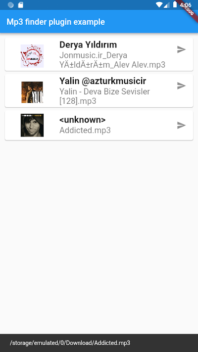

# flutter_mp3_finder

A flutter plugin to get all Mp3 files and it's information like [Path, Album, Album Image, Artist, DateAdded, Duration and Size, ] from phone storage as json format.

``` dart
dependencies:
 flutter_mp3_finder: ^1.0.1
```

Sample Code
```dart 

    try {
      var mp3String = await FlutterMp3Finder.scanDeviceForMp3Files;
      _models = DataModel.fromJson(json.decode(mp3String));
    } on Exception catch (e) {
      print(e);
    }

```
This is Data model you can use:

```dart
class DataModel {
  List<Mp3Model> mp3Files;

  DataModel(this.mp3Files);

  DataModel.fromJson(Map<String, dynamic> json) {
    if (json['Mp3Files'] != null) {
      mp3Files = List<Mp3Model>();
      json['Mp3Files'].forEach((v) {
        mp3Files.add(Mp3Model.fromJson(v));
      });
    }
  }
}

class Mp3Model {
  final String path;
  final String displayName;
  final String album;
  final String albumImage;
  final String artist;
  final String dateAdded;
  final String size;
  final String duration;

  Mp3Model(
      {this.path,
      this.displayName,
      this.album,
      this.albumImage,
      this.artist,
      this.dateAdded,
      this.size,
      this.duration});

  factory Mp3Model.fromJson(Map<String, dynamic> json) => Mp3Model(
        path: json["path"],
        displayName: json["displayName"],
        album: json["album"],
        albumImage: json["albumImage"],
        artist: json["artist"],
        dateAdded: json["dateAdded"],
        size: json["size"],
        duration: json["duration"],
      );
  Map<String, dynamic> toJson() => {
        "path": this.path,
        "displayName": this.displayName,
        "album": this.album,
        "shortName": this.albumImage,
        "artist": this.artist,
        "dateAdded": this.dateAdded,
        "size": this.size,
        "duration": this.duration,
      };
}
```

 

> Only for Android.

